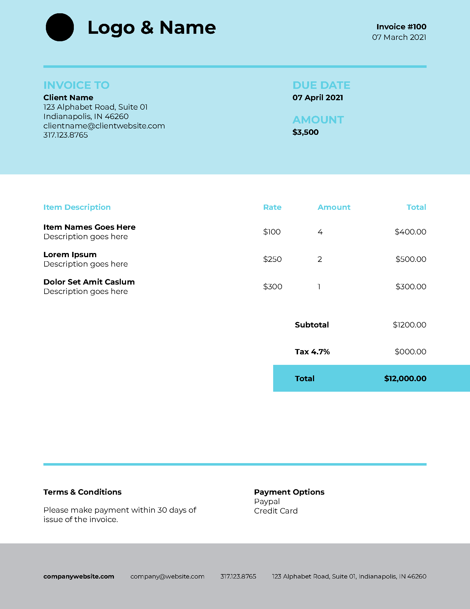
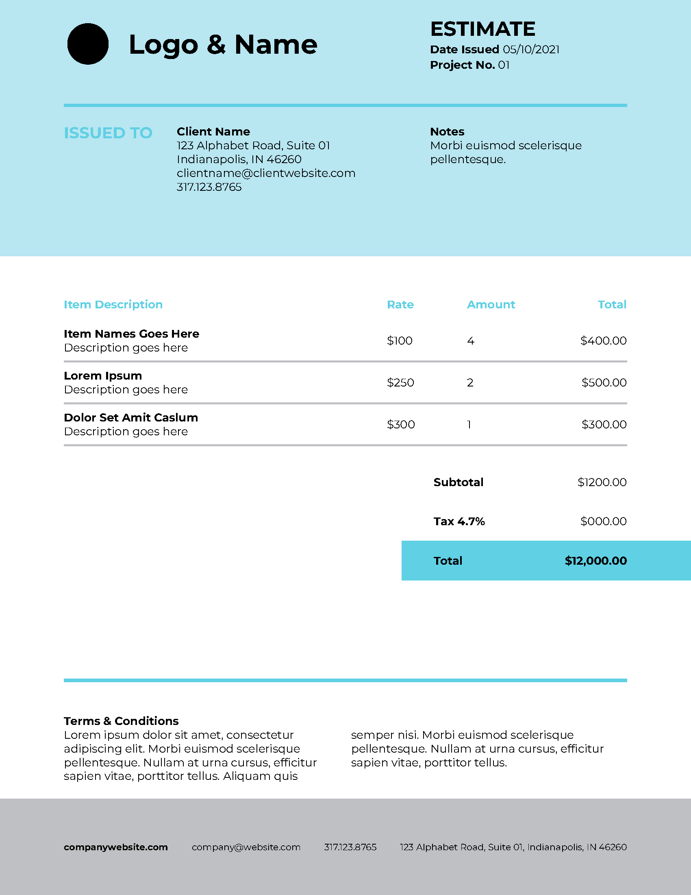
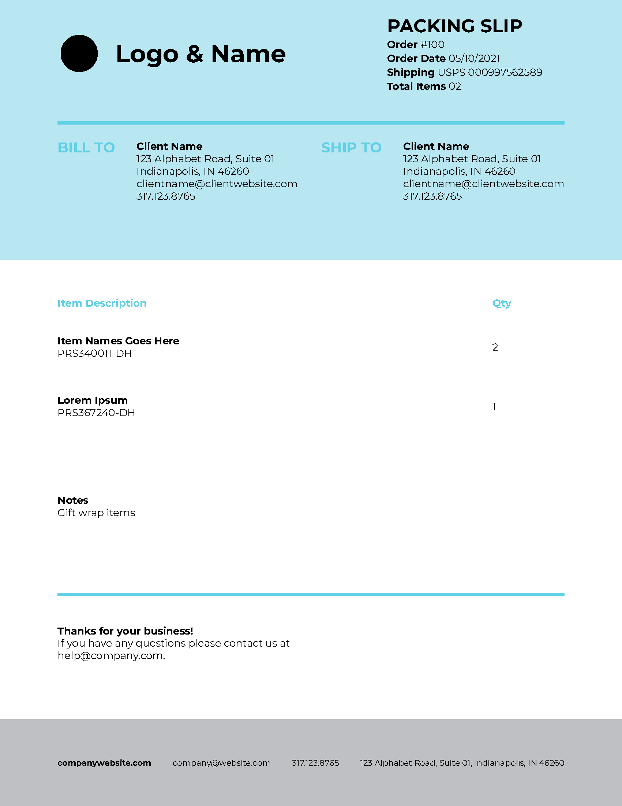

# Free HTML to PDF Templates

These [templates](/templates/) are designed to be use with the [DocRaptor](https://docraptor.com) HTML to PDF API or the [Prince](https://princexml.com) library.

You can use them in personal or commercial projects. Enjoy!

## Development

For each template, there is one HTML file and two CSS files (for the A4 and USLetter document sizes). They're combined into the `template` directory with the `generate-templates.rb` script.

## Contributing

Open a pull-request with any changes or new templates you'd like to add!

## Screenshots

